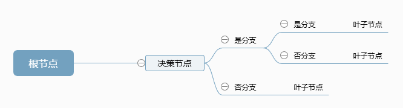
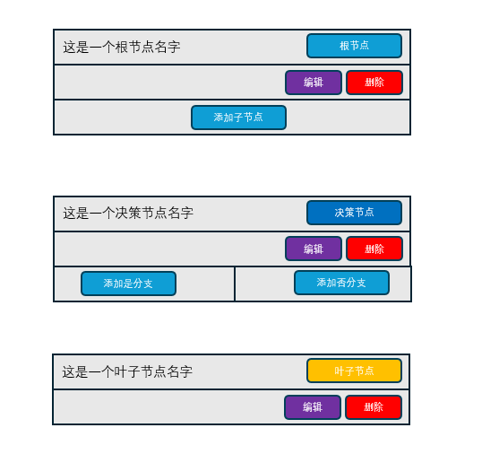
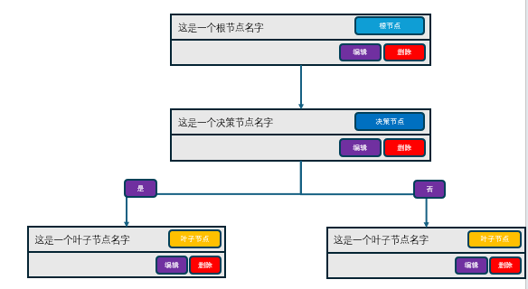

## 1 设备监控
1. 在设备监控展示属性数值的时候增加不同数据获取的方式的标签，分为寄存器、计算和模拟值三种，对应当前的三种数据获取方式。
2. 支持事件的历史状态，在图表中以不同的背景颜色标识事件是否被激活。
3. 查看属性历史数据和事件历史状态时，支持修改时间段的开始结束时间。
4. 调整设备监控页面的UI，将设备照片与设备详情栏合并。左上放图片，右上放设备基本信息，下面放属性、方法和事件，充分利用照片下方区域。
5. 事件的触发条件中增加时间维度的聚合运算和逻辑运算
   1. 支持选择聚合运算的时间长度，包括1分钟、5分钟、30分钟、1个小时、一天和自定义时长。
   2. 支持选择聚合运算的计算方式，包括求和、平均值、最大值、最小值、方差、中位数。
   3. 事件的触发条件中增加逻辑运算，如AND、OR、NOT。
   4. 例如： avg(x,T60) or avg(y,T60) > 5， 表示60秒内的x或y的均值大于5，则触发事件。

- [ ] 修改事件里历史值显示样式
- [ ] 将事件持久化存储，并支持诊断功能？诊断的对象是什么，是单一时刻的报警还是一段时间？如果是一段时间的话，如何与决策树进行关联？决策树和
- [x] 事件的判定逻辑中支持聚合运算判断
- [ ] 在具体设备诊断中应用策略库

## 2 预测性维护

## 3 性能分析

## 4 系统仿真
- [ ] 基于设备组成系统级别的监测、仿真。
1. 系统的构成
   1. 系统由原子设备和管路构建
   2. 原子设备具备参数、变量、关系以及特征等描述项
   3. 管路用于传递设备与设备之间的等量关系
   4. 系统上可以进行变量的设定，以构建新的方程。
2. 系统可以抽象成一组方程，来描述各个设备变量之间的关系。
   1. 方程包括变量设定，如设定‘进口压力 = 10 bar’
   2. 管路上的等量关系，如‘进口压力 = 出口压力’
   3. 变量之间的计算关系，如‘压差 = 出口压力 - 进口压力’
   4. 设备特征，如 ’压差 = f(流量，温度)‘
      1. 设备特征的函数可以通过经验公式获取，所谓的先验
      2. 也可以通过数据驱动回归得到，所谓的后验
      3. 也可以结合公式和数据，在公式框架下利用数据对公式进行修正。
3. 根据方程组的状态，对系统进行模型
   1. 方程满秩时，可以求出未知变量的值
   2. 有效方程大于未知数时，可以进行变量校验。
   3. 有效方程小于未知数时，可以进行优化。
4. 支持非稳态（时间相关）模型

[原型参考](https://modao.cc/app/bb5007806abdf65b9798bb121dea284ec70a5c4b)

## 5 设备百科
_V0.1_
1. 在首页的应用模块中增加一个模块，名称为设备百科。
2. 每次进入设备百科时，可以随机生成一个设备，并对设备的主要原理、功能和应用范围进行介绍
3. 内容可以利用AI生成，利用火山引擎进行生成。
   1. key的信息如下： 
   2. 名称：api-key-20251222160501
   3. API-KEY: c9b588a6-7256-463f-8b38-eb7e12ab2ca5
   4. 模型：doubao-seed-1-8-251215

## 6 数据分析
数据分析模块目前包括项目管理和具体分析项目两个层次，分析项目包括数据导入，数据分析，结论说明三个部分。
1. 在数据导入以后增加数据处理，用于数据清洗和特征提取
   1. 对于数据清洗，支持新建、编辑和删除一个数据清洗实例， 对于一个数据清洗实例，需要选择一个数据清洗对象，即导入的一个数据点
      1. 可以对其进行命名
      2. 支持基于上下限的剔除 
      3. 支持基于方差的异常点剔除 
      4. 支持整时刻的插值对齐，插值可选线性插值和二次插值 
      5. 支持使用基于清洗实例的数据或者清洗前的数据进行分析
   2. 对于特征提取，支持新建、编辑和删除一个特征提取实例，对于一个实例,对于一个数据清洗实例，需要从导入的数据点中选择一个和多个特征提取对象。 
      1. 可以对其进行命名 
      2. 支持数据平滑处理 
      3. 支持多个数据点位的代数运算 
      4. 支持使用基于特征实例的数据进行分析 
      5. 将数据分析的名字修改为分析诊断 
      6. 优化数据分析项目UI布局，充分利用屏幕宽度 
   3. 保持其他模块的功能和UI不变

- [ ] 在数据导入模块选择导入数据点的时间段，仅在后续分析中使用该时间段的数据进行分析。

## 7 知识中心
_V0.1_
1. 在知识中心创建二次模块，包括决策树和知识图谱
2. 在决策树和知识图谱中支持创建、编辑和删除实例
3. 决策树包括根节点、决策节点和叶子节点 
   1. 根节点为待决策项，对于一个决策树来说唯一存在， 
   2. 决策节点为一个二分支节点，通过判定是否来决定分支，决策节点可以下挂决策节点。 
   3. 叶子节点为终端节点，可以挂在决策节点或者根节点下方。 
   4. 支持对决策树中节点的增删编辑。
4. 知识图谱待定义。

_V0.2_

1. 优化决策树的节点增加、编辑和删除功能，包括
   1. UI 支持更加清晰的层级关系，对于同一决策节点的是否分支使用左右排布，而不是目前的上下排布 
   2. 决策节点的是分支和否分支都仅支持单一子节点，无需支持多个。 
   3. 修复决策节点无法创建是分支子节点的问题 
   4. 完成各个节点的编辑功能 
   5. 每一个决策节点都需要可以添加是分支和否分支，包括二次决策以及更深层次的决策节点，同时优化UI，充分利用宽度，避免层级过多时宽度不足

_V0.3_
1. 按照图里的根节点、决策节点和叶子节点的布局进行UI和逻辑进行重构
   1. 一个决策树里面只有一个根节点
   2. 根节点只有一个子节点
   3. 决策节点有两个子节点
   4. 叶子节点没有子节点
   5. 支持节点的下挂子节点的展开和收起
   6. 整体上按照父节点向子节点左右排布
   7. 父子节点关系采用连线表示而不是嵌套

 

_v0.4_
1. 在新建决策树时，支持选择一个设备类型，也可以不选。
2. 在根节点上增加输入框用于输入待决策内容，
3. 当选择了设备类型后：
   1. 在新建和编辑根节点时输入待决策内容可以选择该设备的事件来进行决策，也可以自定义输入
   2. 在新建和编辑决策节点使用该设备类型的属性进行判定。

## 8 设备管理
1. 在设备上在继承设备型号属性的基础上，增加自定义属性
2. 在设备属性列表中支持增加、编辑和删除自定义属性。
3. 自定义属性的绑定同样支持点位读取和计算两种方式。
   1. 对于计算方式，支持属性引用、代数运算、逻辑运算和时间聚合运算，
   2. 其中属性应用和代数运算复用目前的属性计算功能
   3. 逻辑运算和时间聚合运算使用和设备模型中事件触发的运算一致的方式

## ideas
1. 在产品基础功能成型后，可以一个个设备、小系统、大系统这样进行业务功能扩展
2. 可以从设备的设计、生产和运维来进行功能丰富。

## hints
1. ***最好让agent先理解一下图片，确认后再继续***
2. ***当Agent陷入一种循环而理解不足时，可以尝试从头开始***
3. ***可以利用截图和F12帮助agent调试***
4. ***很多时候会形成重复代码，导致AI混乱，当打转转时可以审查是否有重复代码***

